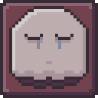

# Reclaim  

  

**What is Reclaim?**  
Reclaim is a heartfelt, small-scale 2D RPG created in memory of my girlfriend's late brother and uncle.

In this journey, you play as Kali, the protagonist, exploring the depths of her mind. Along the way, you'll encounter numerous enemies, with the most common being the 'Forgotten.' Your mission is to liberate these entities, reminding them, and yourself, that they are not alone.  

The adventure involves collecting four crystals from different bosses and locations to unlock the final cutscene. At its core, *Reclaim* is designed to convey a powerful message: grieving is a shared experience, and it’s okay to cherish the memories of those we've lost.  

Strap on your Uggs, it’s time for a rollercoaster of emotions!  

*In loving memory of Charles McCarthy and Gary Vanstrom.*  
